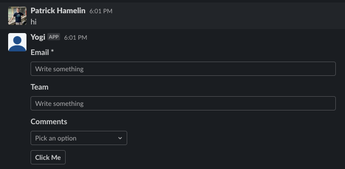
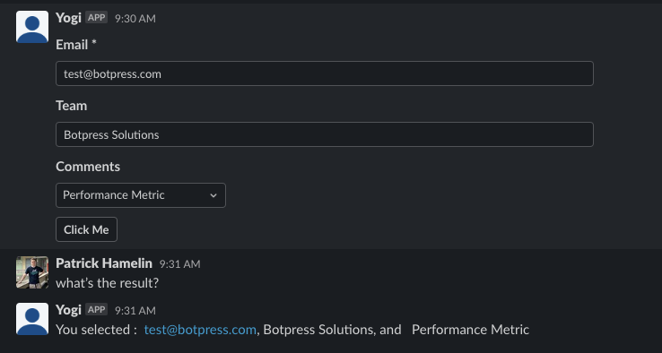

# Add New Element to Channel

Original author: @ptrckbp

Last updated by @ptrckbp on Jul 6 2022

## Overview
By default Botpress channel integrations come with multiple element types like images, text, carousel and cards for you basic needs. If you want to add more element types, you'll have to bypass a few things. This is an example of how to do that on Slack. 

You should get this as a result : 

#### Before inputing text:

#### After inputing text:

## Use cases:
If you want to add a form or some other content type, you can do so with the following code. The code is for a form on slack, but you should be able to adjust it by changing the payload sent to slack, and the channel. 
If you want to update the content sent to slack, please consider using [Slack's Block Kit Builder](https://app.slack.com/block-kit-builder), and pasting the payload in sendform.js.

## How to use

### General idea of the solution: 
- Setup a new api that bypasses the normal processing of Slack messages
- Create a new action that sends the form to the correct user and saves the data to the user
- Create a hook that transfers information from the user to the temp variable for a more consistent experience. 
- (optional) for testing, I (We) suggest you add on-unmount.js to clear the api when unmounting and remounting.

### In Slack:
1. Go to https://api.slack.com/apps
2. Select your app
3. In the navigation bar, select "Interactivity & Shortcuts"
4. Set the value of the link to <your domain>/api/v1/bots/<your bot id>/mod/slack/interaction
5. Save and open Botpress

### In Botpress:
1. Open your app
2. Go to the code editor
3. Add four files to your project (the names can be changed) you can find them here 
- [sendform.js](sendform.js) That's what sends the form to the user. Copy this to actions.
- [server.js](server.js) That's what sets up the api. Copy this to a new after-bot-mounted hook
- [incoming.js](incoming.js) This takes information from the user and sets it to temp for convenience. Copy this to a new before-incoming hook
- [on-unmount.js](on-unmount.js) This helps with making changes. You can copy this to after-unmount hook.
4. In the flow editor, open a node, and add this action, filling in the four inputs for labels and choices.
5. You will be able to access the value in temp.formValues. 
